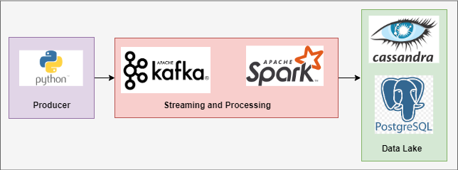

# Streaming data
This project uses producer to generate data from csv files each as one topic and kafka send these messages then spark write these stream data to database.

## Overview
- [Overview](#overview)
- [Steps](#steps)
- [Architecture](#architecture)
- [Get Started](#get-started)
- [Topics and Brokers in UI](#topics-and-brokers-in-ui)

## Steps
1. Data streaming with kafka
2. Data processing with spark
3. Scheduling with Airflow

## Architecture

## Get Started
- make up

## Topics and Brokers in UI

