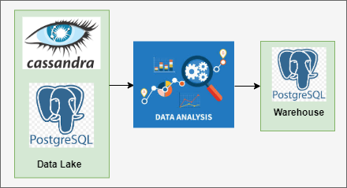

# Data Analysis

## Architecture

### Top 2 Categories
- What was the top category watched by total rental count? 2. How many total films have they watched in their top category and how does it compare to the DVD Rental Co customer base?
- How many more films has the customer watched compared to the average DVD Rental Co customer?
- How does the customer rank in terms of the top X% compared to all other customers in this film category? 
- What are the top 3 film recommendations in the top category ranked by total customer rental count which the customer has not seen before?
- What is the second ranking category by total rental counts? 
- What proportion of each customer’s total films watched does this count make? 
- What are top 3 recommendations for the second category which the customer has not yet seen before?

### Summary
1. Identify top 2 categories for each customer based off their past rental history
2. For each customer recommend up to 3 popular unwatched films for each category
3. Generate 1st category insights that includes:
- How many total films have they watched in their top category?
- How many more films has the customer watched compared to the average DVD Rental Co customer?
- How does the customer rank in terms of the top X% compared to all other customers in this film category?

## ERD Diagram

### Solution Plan
#### Category Insights
1.	Create a base dataset and join all relevant tables
-	complete_joint_dataset
2.	Calculate customer rental counts for each category
-	category_counts
3.	Aggregate all customer total films watched
-	total_counts
4.	Identify the top 2 categories for each customer
-	top_categories
5.	Calculate each category’s aggregated average rental count
-	average_category_count
6.	Calculate the percentile metric for each customer’s top category film count
-	top_category_percentile
7.	Generate our first top category insights table using all previously generated tables
-	top_category_insights
8.	Generate the 2nd category insights
-	second_category_insights

#### Category Recommendations
1.	Generate a summarised film count table with the category included, we will use this table to rank the films by popularity
-	film_counts
2.	Create a previously watched films for the top 2 categories to exclude for each customer
-	category_film_exclusions
3.	Finally perform an anti join from the relevant category films on the exclusions and use window functions to keep the top 3 from each category by popularity - be sure to split out the recommendations by category ranking
-	category_recommendations
