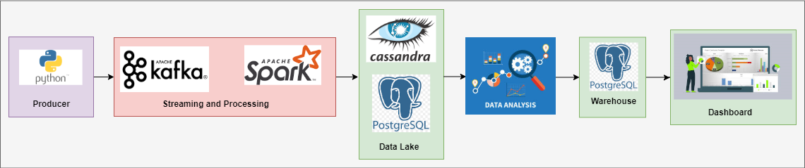

# DataPipelineAnalysis

## Overview
- [Overview](#overview)
- [Pipeline](#Pipeline)
- [Architecture](#architecture)

## Pipeline
1. Streaming: Orchestrate with Docker-compose
    - Producer streaming with Kafka
    - Consumer streaming and processing with Spark
2. Data Analysis
    - Query with PostgreSQL
3. Dashboard: Orchestrate with Docker-compose
    - Visualization with Superset

## Architecture
